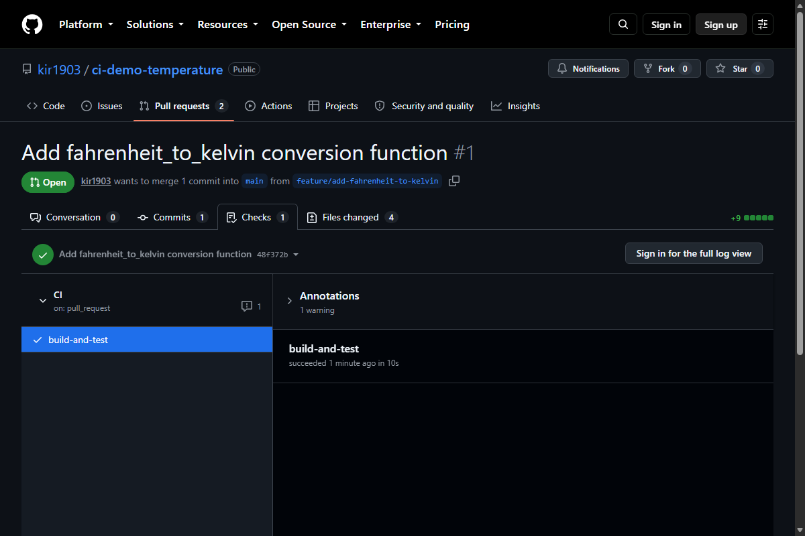
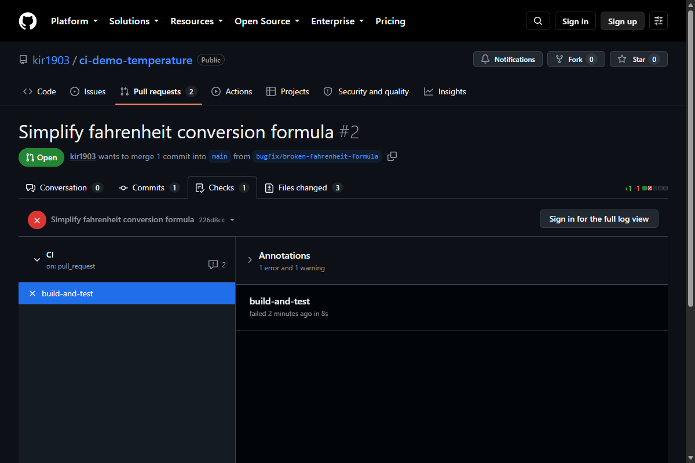

# Задание 106. Continuous Integration (CI)

## Описание проекта

Небольшая библиотека для конвертации температур между шкалами Цельсия, Фаренгейта и Кельвина, с проверкой корректности входных значений (запрет температур ниже абсолютного нуля).

Репозиторий проекта: https://github.com/kir1903/ci-demo-temperature

## Структура

```text
src/temperature.py        — функции конвертации
tests/test_temperature.py — юнит-тесты (pytest)
requirements.txt          — зависимости
.github/workflows/ci.yml  — пайплайн CI
```

## Запуск локально

```bash
pip install -r requirements.txt
python -m pytest tests/ -v
```

## Настройка CI

Используется **GitHub Actions**. Файл пайплайна: `.github/workflows/ci.yml`.

Пайплайн запускается автоматически при создании pull request в ветку `main` и выполняет шаги последовательно:

1. Checkout репозитория.
2. Установка Python и зависимостей проекта (`pip install -r requirements.txt`).
3. Сборка — проверка синтаксиса модуля (`python -m py_compile`).
4. Запуск тестов (`pytest`).

Если один из шагов завершается с ошибкой (например, тест не проходит), весь пайплайн завершается с ошибкой, и pull request помечается как непрошедший проверку.

```yaml
name: CI

on:
  pull_request:
    branches: [main]

jobs:
  build-and-test:
    runs-on: ubuntu-latest

    steps:
      - name: Checkout repository
        uses: actions/checkout@v4

      - name: Set up Python
        uses: actions/setup-python@v5
        with:
          python-version: "3.11"

      - name: Install dependencies
        run: |
          python -m pip install --upgrade pip
          pip install -r requirements.txt

      - name: Build (syntax check)
        run: python -m py_compile src/temperature.py

      - name: Run tests
        run: python -m pytest tests/ -v
```

## Демонстрация работы пайплайна

Для демонстрации подготовлены две ветки в репозитории:

- `feature/add-fahrenheit-to-kelvin` — добавляет новую функцию конвертации и тест к ней. Все тесты проходят, пайплайн завершается успешно.
- `bugfix/broken-fahrenheit-formula` — намеренно содержит ошибку в формуле конвертации Цельсия в Фаренгейт (пропущено слагаемое `+32`). Тест `test_celsius_to_fahrenheit` не проходит, пайплайн завершается с ошибкой.

### Успешный запуск

Pull request из ветки `feature/add-fahrenheit-to-kelvin` в `main`.



### Неуспешный запуск

Pull request из ветки `bugfix/broken-fahrenheit-formula` в `main`.


